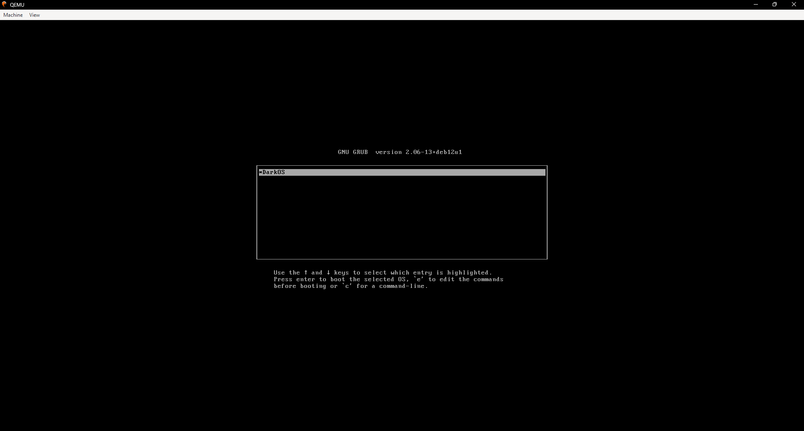
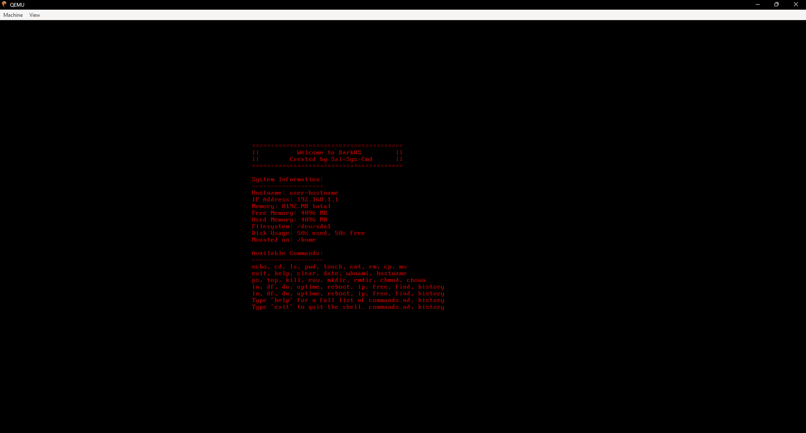

# DarkOS - Building an OS on My Own

DarkOS is a simple 64-bit operating system that I built from scratch. This project was an intensive study into low-level programming, covering everything from bootloading to kernel development.

## Preview


*This is the setup page of DarkOS, displaying the initial boot sequence.*

<br>


*This is what happens when DarkOS is running, executing the core functionalities.*

<br>

## How I Built It

DarkOS was built using the following tools and files:
- **Docker**: Used to create a reproducible build environment.
- **Qemu**: Emulated the OS without needing real hardware.
- **Assembly & C**: Developed core OS components, including bootloading and kernel execution.
- **Key files used in the build process:**
  - `.gitattributes`, `.vscode/` (configuration files)
  - `LICENSE`, `Makefile` (project setup and build rules)
  - `build/`, `dist/`, `src/` (compiled files and source code)
  - `buildenv/Dockerfile` (Docker environment for compilation)
  - `targets/` (ISO and linker setup for booting)

## Future Plans

In the future, I plan to add interactive shell features to DarkOS, allowing users to input commands and interact with the system.

## Prerequisites

To build and run DarkOS, you will need:

- A text editor such as [VS Code](https://code.visualstudio.com/).
- [Docker](https://www.docker.com/) for creating the build environment.
- [Qemu](https://www.qemu.org/) for emulating the OS.
  - Make sure to add Qemu to your system's PATH for easy access.

## Setup

Build an image for the build environment:
```sh
docker build buildenv -t myos-buildenv
```

## Build

Enter the build environment:
```sh
# Linux or MacOS
docker run --rm -it -v "$(pwd)":/root/env myos-buildenv

# Windows (CMD)
docker run --rm -it -v "%cd%":/root/env myos-buildenv

# Windows (PowerShell)
docker run --rm -it -v "${pwd}:/root/env" myos-buildenv
```

Build for x86_64:
```sh
make build-x86_64
```
**Note:** If you are using Qemu, close it before running this command to prevent errors.

To leave the build environment, enter:
```sh
exit
```

## Emulate

Run DarkOS using Qemu:
```sh
qemu-system-x86_64 -cdrom dist/x86_64/kernel.iso
```

If this command fails, try one of the following:

- **Windows:**
  ```sh
  qemu-system-x86_64 -cdrom dist/x86_64/kernel.iso -L "C:\Program Files\qemu"
  ```
- **Linux:**
  ```sh
  qemu-system-x86_64 -cdrom dist/x86_64/kernel.iso -L /usr/share/qemu/
  ```
- Alternatively, install a custom BIOS binary file and link it to Qemu using the `-L` option.

## Cleanup

To remove the build environment image:
```sh
docker rmi myos-buildenv -f
```
